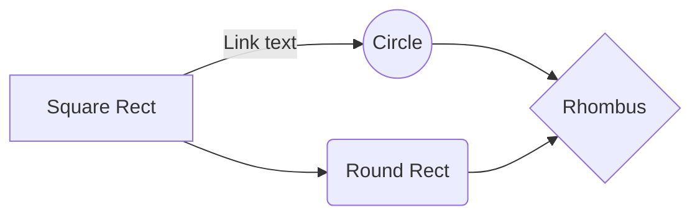

# XNet

WIP. A multi-purpose, multi-threaded, epoll server framework that uses an addon approach to expand it's modularity.


# Overview

Although XNet was made to **make server development easier**. It's still crucial to understand the underlying structure. XNet is a server framework and does have support for **out-of-the-box** use cases. However, to squeeze all of the possibilities out of XNet, this documentation will explain everything such as the event structuring, session handling, addon systems, threading, packet subscription, etc. This is your guide to all things XNet.

# How To Use

### Sample
```c
#include  "xnet_base.h" // XNet's core library.

int main(void)
{
	const char *ip   = "127.0.0.1";
	size_t port      = 47007;
	size_t backlog   = 5;
	size_t timeout   = 300;
	xnet_box_t *xnet = xnet_create(ip, port, backlog, timeout);
	xnet_start(xnet);
	xnet_destroy(xnet);
}
```

### Result
```
user@my_computer:~$ ./a.out
[XNet]
IP: 127.0.0.1
Port: 47007
```
> **Note:** If there are any issues in regards to getting this output when attempting to execute the above code. Ensure you have no linker errors, and that the header file is being properly recognized.

### Explanation
By including the **header file**, you will be exposed to three very important functions.
```c
xnet_create();
xnet_start();
xnet_destroy();
```
These functions consist of the **bare minimum** when it comes to a running an instance of XNet. A more comprehensive explanation of what these functions do will be explained further down. The fundamental aspect to understand here is that XNet has a **very specific loading process**. See below.

# The loading process

XNet consists of a five-part loading process. Understanding this will make understanding everything else much easier.

## 1. Create Server
Creating the server consists of calling the following function signature.
```c
xnet_box_t *xnet_create(const char *ip, size_t port, size_t backlog, size_t timeout);
```
This accomplishes a few things. Ensures the values given are valid and assigns them to the server. As well as it initializes necessary memory for all the internal server categories.
> **Note:** These internal server categories consist of General, Network, Thread, Connections, and Userbase. They are all covered more deeply, further in the guide.

There are two static functions responsible for the majority of this heavy lifting.
```c
// Attempts to initialize memory for internal server categories.
static xnet_box_t *initialize_xnet_box(void);
```
```c
// Primarily handles socket configuration
static int xnet_configure(xnet_box_t *xnet);
```


## 2. Configure Server
This step is where the end-user will be doing **essentially all of the configuration**.

## 3. Start Server


## 4. Handle  Events


## 5. Shutdown and Cleanup
